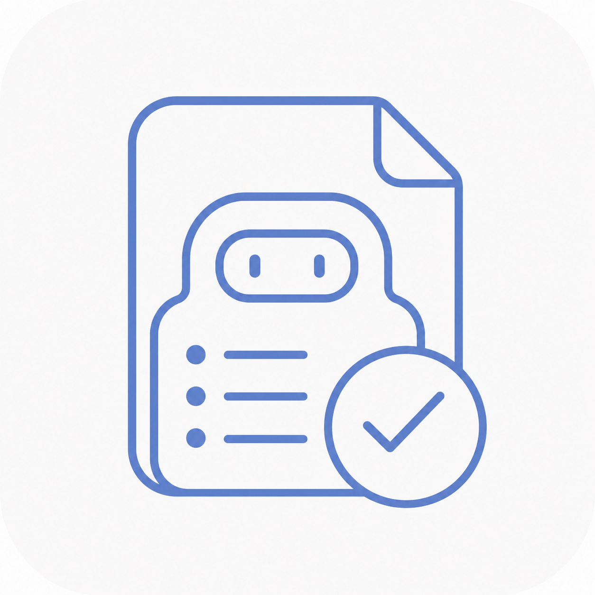

<p align="center" style="margin-bottom: 6px;">
  
</p>

<h1 align="center" style="margin-top: 0;">Talent Hub</h1>

<p align="center">
  <em>本地运行、证据驱动的 AI 人事工作台，覆盖招聘全流程与考勤核算：从 BOSS 直聘找人、AI 预评分、简历筛选、电话确认到候选人跟进，以及飞书打卡的自动同步与核算，让每一次判断都有据可循。</em>
</p>

<p align="center">
  <a href="README.en.md">English</a> · 简体中文
</p>

<p align="center">
  
  
  
  
  
  
</p>

<p align="center">
  
  
  
  
</p>

> [!IMPORTANT]
> AI 结果仅用于招聘辅助，不构成自动录用或淘汰决定。HR 与用人部门始终保留最终判断权。

## 目录

- [它解决什么问题](#它解决什么问题)
- [HR 提效的核心场景](#hr-提效的核心场景)
- [当前能力](#当前能力)
- [技术特性](#技术特性)
- [快速开始（开发环境）](#快速开始开发环境)
- [应用设置（配置项说明）](#应用设置配置项说明)
- [飞书推送配置（可选）](#飞书推送配置可选)
- [Windows 构建](#windows-构建)
- [macOS 构建](#macos-构建)
- [数据与安全](#数据与安全)
- [项目结构](#项目结构)
- [使用边界](#使用边界)

## 它解决什么问题

招聘与考勤中重复性最高、也最容易因判断尺度不一而失真的工作：批量简历初筛、判断依据的复核与说明、电话录音要点整理与结果汇总，以及每月飞书打卡的匹配与出勤核算。

Talent Hub 把招聘串成「找人 → 预评分 → 打招呼 → 收简历 → 筛选 → 电话确认 → 面试 → 录用」一条可跟踪的漏斗，并把考勤核算自动化，逐条留下可核验的依据，结果可直接交付。设置、任务材料与结果默认保存在本机；启用模型、ASR 或飞书功能时，相应内容会发送至所配置的服务。

## HR 提效的核心场景

| 业务环节 | Talent Hub 的处理方式 |
| --- | --- |
| **候选人获取** | 从 BOSS 直聘拉取在招职位与候选人，AI 预评分后进入跟进看板 |
| **候选人跟进** | 从发现到录用的阶段看板，评分、打招呼、约面、面试、录用一条线跟踪 |
| **批量初筛** | 按统一标准自动筛出分档名单 |
| **判断与复核** | 每个判断附可回溯依据，存疑项自动标注 |
| **电话确认** | 录音自动转写并整理成要点，校对后导出档案 |
| **结果交付** | 生成统一的评估结果与推荐名单 |
| **结果同步** | 任务完成后推送摘要至指定飞书群 |
| **考勤核算** | 飞书打卡自动同步，匹配员工并核算出勤，跨日异常仅需人工审核 |

## 当前能力

以下为当前已支持的模块：

### 招聘接入（BOSS 直聘）

| 能力 | 说明 |
| --- | --- |
| **目标岗位选择** | 在「招聘工作台 → 触达审核」面板从已拉取的职位中选择当前目标岗位，只处理该岗位的职位、推荐候选人与往来消息；留空则处理全部职位。 |
| **职位自动导入** | 定时拉取在招职位，为每个首次出现的职位创建筛选任务并写入岗位说明。 |
| **候选人获取** | 拉取职位推荐候选人并写入候选人库，等待 AI 预评分后进入「待打招呼」清单。 |
| **触达审核** | 所有对外发送先生成待审核草稿；HR 在「招聘工作台 → 触达审核」中逐条批准或否决，也可一键发送当前目标岗位的全部待审核草稿。发送失败会记录原因，不阻塞其余草稿。 |
| **往来消息处理** | 对方主动发来消息时按类型处理：附件简历确认卡片自动「同意接收」；对方已发来的附件简历直接进入下载、不再索要；其他消息生成「回复并索要简历」草稿。 |
| **附件简历回填** | 候选人已发来的附件简历自动下载并写入对应任务；已触达但连续 3 轮未取到简历时生成一次「求简历」草稿。 |
| **自动推进筛选** | 已有岗位说明与简历的任务自动启动筛选；筛选完成后 S 级候选人自动进入电话确认任务。 |
| **去重与状态记录** | 已处理的职位与候选人状态保存在本机，同一职位与候选人不会重复走流程。 |
| **引擎控制** | 自动化引擎随应用启动，默认每 5 分钟推进一轮；可在界面停止、重新启动或立即运行一轮。 |

> [!NOTE]
> 招聘接入依赖独立部署的 boss-cli 与已登录的 BOSS 直聘账号；前置条件与配置步骤见 [APP_GUIDE「招聘接入」](APP_GUIDE.md#招聘接入)。

### 招聘接入（智联招聘）

智联招聘通过独立部署的 zhaopin-cli 接入，提供以下命令能力：

| 能力 | 说明 |
| --- | --- |
| **登录** | `zhaopin login` 打开智联招聘登录页，由使用者本人完成登录，登录态保存在本机，后续命令自动复用。 |
| **企业端导航** | `zhaopin home` 直接把浏览器跳到智联企业端候选人推荐页；未登录时返回提示，先执行 `zhaopin login` 即可。 |
| **岗位查看** | `zhaopin positions [关键词]` 打开职位选择弹层，列出可选岗位，支持按关键词过滤。 |
| **岗位切换** | `zhaopin recommend <岗位关键词>` 通过职位弹层切换到指定岗位后再读取候选人，不依赖页面上不稳定的当前岗位文字。 |
| **候选人读取** | `zhaopin recommend` 通过真实滚轮逐步加载推荐列表，按姓名去重后输出基本信息与是否可打招呼。 |
| **详情读取** | `zhaopin open <姓名>` 打开候选人详情面板，输出正文后自动关闭，入口优先点姓名区域以避开右侧操作按钮。 |
| **打招呼** | `zhaopin greet <姓名>` 对候选人打招呼；首次出现的招呼语弹框会自动确认发送，已打过招呼的候选人会被识别出来并跳过。 |
| **索要信息** | `zhaopin request <姓名> [resume\|phone\|wechat]` 打开聊天框索要附件简历、电话或微信，动作可组合，默认索要附件简历；索要电话时出现的方式选择层会自动确认一次。 |
| **简历下载** | `zhaopin download <姓名>...` 与 `zhaopin download-all` 把对方发来的附件简历统一下载到 `~/.zhaopin-cli/downloads/`，同一候选人去重跳过；支持 PDF 与 .doc 两种落盘形态。 |
| **简历分析** | `app/connectors/zhaopin_imports.py` 读取推荐候选人并抓取在线简历正文，按 Markdown 落盘后写入 Talent Hub 任务，直接复用既有的筛选流水线（生成标准 → 评估 → S/A/B/C 分级）。 |
| **连接器** | `app/connectors/zhaopin_cli.py` 以子进程方式调用上述命令，把纯文本输出解析为结构化数据供上层使用。 |

> [!NOTE]
> 智联已接入后台自动化引擎：拉职位、拉推荐候选人、打招呼与索要附件简历都走「先生成待审核草稿、HR 审核后再执行」的流程，可用「智联目标岗位」或环境变量 `BENATS_ZHAOPIN_TARGET_JOB` 限定岗位。应用侧的读未读消息、附件简历下载与自动评分目前仍只对 BOSS 生效（智联已提供 `zhaopin download` / `download-all` 命令，尚未接入自动化引擎）。前置条件与配置步骤见 [APP_GUIDE「智联招聘」](APP_GUIDE.md#智联招聘)。

### 候选人跟进

| 能力 | 说明 |
| --- | --- |
| **阶段看板** | 按「待打招呼 → 已打招呼 → 待评分 → 筛选中 → 面试中 → 已结束」分列展示候选人，每个候选人一张卡片，显示姓名、岗位、评分档位与理由。 |
| **AI 预评分** | 打招呼前先按岗位 JD 对在线简历做四档粗筛（S 电话沟通 / A 优先约面 / B 电话确认 / C 不推进），明显不匹配的自动标记跳过，减少无效触达。 |
| **批量打招呼** | 评分合格的候选人进入「待打招呼」清单，HR 勾选后批量打招呼。 |
| **阶段推进** | 候选人可从发现一路手动推进到面试、录用、淘汰，全程在本机 SQLite 中持久化。 |
| **招聘作业台** | 四步向导发起一次被动咨询作业：职位与账号 → 招聘标准 → 执行方案 → 执行前检查，检查通过后启动，系统自动完成拉候选人、打招呼、求简历与下载评分。 |

### 简历筛选

| 能力 | 说明 |
| --- | --- |
| **岗位标准先行** | 从 JD 生成岗位本质、核心对象、业务场景、关键动作、硬门槛、负向信号、逐维度打分锚点与 A/B/C 判定规则。 |
| **证据驱动评估** | 匹配与不匹配判断须以简历原文为支撑：优先引用原文，也可基于完整经历合理推断；无法在原文中找到任何事实支撑的判定会被降档或转人工确认。 |
| **逐维度打分与 S 级** | 模型按四个核心维度（对象/场景/动作/深度）输出 0-10 分；硬门槛全过、结论为 A 且四维分数均达标时，程序判定为 S 级并转入电话沟通。 |
| **分层建议** | 程序按统一状态机输出「S 电话沟通」「优先约面（A）」「电话确认（B）」「不推进（C）」：明确硬条件或核心维度不满足为 C，关键信息未知为 B，全部通过为 A，四维打分达标的 A 升为 S。 |
| **批量评估** | 支持 1–12 路并发；每份简历进入一条评估流程，遇可重试的传输错误或 JSON / 结构校验失败时可能再次请求模型。单份解析或模型请求失败不会中断其他简历。 |
| **失败结果保留** | 每份成功结果即时保存在本机；批次收尾失败时仍可查看已完成候选人并重新开始，未生成正式产物前不开放下载、追加或通知操作。 |
| **横向对比** | 对最多 20 位 S/A/B 候选人做横向比较；程序保证 S 整体排在 A 前、A 排在 B 前，AI 只决定同等级内部顺序与理由。 |
| **多格式解析** | 支持 PDF、DOCX、TXT、Markdown 与常见图片；扫描件可接入 Tesseract OCR。 |
| **可交付结果** | 生成并校验五张工作表的 Excel（候选人总表含逐维度评分摘要与推荐顺序、证据匹配表、电话确认问题、筛选标准、推荐名单）与 Markdown 筛选标准。 |

### 电话确认

| 能力 | 说明 |
| --- | --- |
| **S 级沟通名单** | 启用自动化时，筛选完成的 S 级候选人自动进入电话确认任务，带名单与一句话判定，供 HR 逐人电话跟进。 |
| **批量录音转写** | 上传多段录音（m4a / wav / mp3 / ogg / opus），接入火山引擎 ASR。 |
| **AI 整理** | 以高级招聘专员口径生成面向用人部门的结构化记录、优先参考关注维度且不限维度的软性素质评价，以及可选快筛问答（默认关闭以减少模型输出长度与整理耗时）。 |
| **结构化结果交付** | 程序只校验 JSON 和必填结构，不删除模型返回的客观要点或软性素质评价，也不根据事实引用改写字段状态；事实引用仅用于录音定位。 |
| **人工校对与下载** | 日期默认任务标题随界面语言显示，手动标题保持原文；逐人校对后，每位候选人导出 Markdown 档案。 |

### 飞书推送

| 能力 | 说明 |
| --- | --- |
| **任务完成自动通知** | 简历筛选完成或电话整理完成后，自动把结果推送到指定飞书群。 |
| **面向 HR 的结果消息** | 简历每轮推送一条总览，含提交/成功/失败人数、S/A/B/C 分布及最多 5 位 S/A/B 候选人的一句话判定；电话按候选人逐条推送整理记录，超出单条消息容量时截断并提示回到应用查看。 |
| **增量去重** | 追加简历只通知本轮新增结果并显示岗位累计人数；追加录音只发送尚未成功推送的新条目；修改筛选标准后的全量重筛会作为新版本通知。 |
| **可靠发送** | 临时网络错误、HTTP 429 和 5xx 会有限重试并执行频控；推送失败只记录提示，不改变筛选/电话任务的业务状态。 |
| **手动重试简历通知** | 在已完成的简历筛选结果页可点击「重试飞书通知」，仅补发仍待通知的结果，并显示本次是否真实发送。电话任务页当前未接入手动重试入口，重试能力由后端接口提供。 |
| **测试飞书链接** | 设置中可发送测试消息，验证 Webhook 连通性。 |

### 考勤管理

| 能力 | 说明 |
| --- | --- |
| **多角色登录** | 独立的账号体系（系统管理员 / HR / 部门主管 / 只读），密码 PBKDF2 哈希保存；管理员与 HR 拥有编辑权限。默认账号 `admin` / `admin`，首次登录会强制要求设置新密码，未修改前无法进行任何写操作。 |
| **人员档案与策略** | 人员档案（工号、姓名、别名、部门、岗位）、标签与考勤策略（标准 / 弹性 / 免考勤 / 兼职 / 轮班）分别管理。 |
| **飞书打卡导入** | 导入飞书打卡 `.xlsx`，按工号优先、姓名 / 别名兜底匹配；空白或 `-` 算休息，有打卡算出勤。 |
| **飞书自动同步** | 通过飞书开放平台企业自建应用定时拉取打卡结果（含考勤机打卡），无需手动导出 Excel；需开通「导出打卡数据」权限，凭据在「考勤设置」中配置。 |
| **跨日疑似审核** | 识别「次日」记录与凌晨打卡的跨日疑似，人工审核归前一天或保留当天。 |
| **核算与导出** | 按策略自动核算出勤天数，支持人工调整、确认、规则轨迹与 Excel 汇总导出（汇总 / 核算明细 / 原始打卡三表）。 |
| **考勤看板** | 支持跨月查询与部门筛选，提供每日出勤率折线图、部门对比与导入汇总。 |

## 技术特性

- **本地优先**：设置、原始任务材料与结果默认保存在用户数据目录（Windows：`%LOCALAPPDATA%\TalentHub`；macOS：`~/.local/share/TalentHub`），默认目录位于源码目录之外；通过 `TALENT_HUB_DATA_DIR` 或 `--data-dir` 自定义时由使用者选择位置。
- **密钥安全**：Windows 使用当前用户的 DPAPI 加密模型、ASR 与飞书签名密钥；macOS 通过环境变量提供敏感密钥。
- **回环隔离**：服务仅监听 `127.0.0.1`，每次启动生成随机会话令牌。
- **公平性防护**：模型提示词禁止使用年龄、性别、民族、籍贯、婚姻和生育状况进行评价或排序；程序同时按内置受保护属性关键词过滤硬门槛、A/B/C 条件和负向信号。该防护不能替代人工偏差复核。
- **前端**：React + TypeScript（Vite 构建），由 FastAPI 托管构建产物。
- **SQLite 存储**：考勤与候选人数据使用 Python 标准库 sqlite3 持久化（`attendance.db` 与 `recruitment.db`），不引入额外数据库依赖。
- **多角色登录**：考勤模块内置账号体系（系统管理员 / HR / 部门主管 / 只读），密码 PBKDF2 哈希保存。
- **飞书通知可选**：使用飞书自定义机器人 Webhook 推送结果摘要，无新增第三方依赖。
- **BOSS 直聘接入可选**：通过本机 boss-cli（独立部署的 Node/TS 命令行工具，基于 CDP 驱动本机 Chrome）读取职位、候选人与附件简历，并把经 HR 审核的触达动作交给它发送；未安装或未登录时仅招聘接入相关功能不可用，其余模块不受影响。
- **智联招聘接入可选**：通过本机 zhaopin-cli（独立部署的 Node/TS 命令行工具，基于 CDP 驱动本机 Chrome）读取职位、候选人与详情并执行打招呼；未安装或未登录时仅智联相关命令不可用，其余模块不受影响。点击、滚动与输入均使用浏览器原生事件，不通过注入脚本驱动页面。

## 快速开始（开发环境）

**前置条件**：Windows 或 macOS、Python、Node.js 与 npm，以及可用的 OpenAI Chat Completions 兼容模型服务。

1. 安装依赖：

   ```powershell
   python -m pip install -r requirements.txt
   ```

   需要运行后端测试时，再安装开发依赖 `python -m pip install -r requirements-dev.txt`，然后执行 `python -m pytest`。

2. 构建前端（后端直接托管 `frontend/dist` 构建产物）：

   Windows：

   ```powershell
   cd frontend
   npm ci
   npm run build
   ```

   macOS：

   ```bash
   cd frontend && npm ci && npm run build
   ```

   > Windows 快捷方式：完成 Python 与前端依赖安装后，可双击根目录 `start-app.bat`。该脚本启动后端并运行 `npm run build -- --watch` 自动重建前端，但不执行 `npm ci`；刷新页面即可看到前端改动。

3. 启动应用：

   Windows：

   ```powershell
   python -X utf8 -m app.main
   ```

   macOS：

   ```bash
   export TALENT_HUB_API_KEY="你的模型 API Key"
   python -X utf8 -m app.main
   ```

应用启动后会在默认浏览器打开。首次使用时，Windows 在设置中填写接口地址、接口密钥与模型名称，并测试连接；macOS 在启动前配置 `TALENT_HUB_API_KEY`，设置中只填写接口地址和模型名称等非敏感项。

> [!NOTE]
> 文本型 PDF、DOCX、TXT、Markdown 无需 OCR；处理扫描 PDF 或图片时需安装 Tesseract（中文简历建议安装 `chi_sim` 语言包）。应用会从 `TESSERACT_CMD`、`PATH` 和平台常见路径自动探测；探测失败时再在设置中填写程序路径。Windows 可从 [UB Mannheim 安装包](https://github.com/UB-Mannheim/tesseract/wiki) 安装（安装时勾选简体中文语言包）；macOS 可通过 `brew install tesseract tesseract-lang` 安装。分步指引见 [APP_GUIDE「OCR 配置」](APP_GUIDE.md#ocr-配置)。

## 应用设置（配置项说明）

在应用顶栏右侧的「设置」弹窗中集中管理以下配置。其中「接口地址」「接口密钥」「模型名称」为必填，其余为可选或按需调整。

| 配置 | 默认值 / 范围 | 说明 |
| --- | --- | --- |
| 接口地址 | `https://api.openai.com/v1` | 兼容 Chat Completions 与 JSON 输出的 OpenAI 格式服务；填写不含 `/chat/completions` 的基础地址，应用会自动追加该路径，不强制以 `/v1` 结尾。 |
| 接口密钥 | 空 | 模型服务的访问密钥；Windows 使用 DPAPI 加密保存，macOS 使用 `TALENT_HUB_API_KEY` 环境变量。 |
| 模型名称 | 空 | 实际使用的模型标识，由模型服务商决定。 |
| 并发数 | 6（1–12） | 每批并行处理的候选人数量；耗时受候选人数、模型服务延迟与限流影响，遇限流时应下调。 |
| 超时（秒） | 180（30–600） | 普通模型 HTTP 请求每次尝试的超时。筛选标准与单份简历的每轮模型调用分别允许最多 3 次和 2 次可重试传输尝试；JSON / 结构校验失败时可再发起一轮模型调用纠正。电话整理的每轮模型调用中，每次尝试至少使用 300 秒，允许最多 3 次可重试传输尝试；结构校验失败时也可再发起一轮。 |
| 文字识别程序路径 | 空 | 处理扫描 PDF 或图片简历时的 Tesseract 程序路径；留空时自动探测，详见上文 OCR 说明。 |
| 在本机任务目录保留解析后的简历文本 | 开启 | 是否在本机保留逐份简历的解析文本；关闭后不保存这些文本，但仍保留解析后的 JD 与不含简历正文的解析清单。 |
| 语音转写密钥 | 空 | 火山引擎大模型语音识别（录音文件极速版）的 API Key；Windows 使用 DPAPI 加密保存，macOS 使用 `TALENT_HUB_ASR_API_KEY` 环境变量。 |
| 生成电话快筛详情（问答原文） | 关闭 | 开启后电话整理会生成通篇问答原文；关闭时可减少模型输出长度与整理耗时。 |
| 对 A 类结论执行二次复核 | 关闭 | 开启后简历筛选会对初筛 A 类候选人追加一次独立复核调用；复核与初评结论不一致时降为 B 并生成核实问题。会增加模型调用量。 |

### 语音转写（火山引擎）配置

电话确认的录音转写依赖**火山引擎大模型语音识别（录音文件极速版）**，只需一个 API Key。

1. 打开[火山引擎语音 / 豆包语音控制台](https://console.volcengine.com/speech/app)并登录（未注册需先注册并完成实名认证）。
2. 创建应用，并**务必勾选「录音文件极速版 / 大模型语音识别极速版」**（资源 `volc.bigasr.auc_turbo`）；不要误选标准版或实时流式识别，否则无法转写本地录音文件。
3. 在控制台的「API Key」页面（新版控制台）复制 **API Key**。
4. Windows 在应用「设置」中把该 Key 填入「语音转写密钥」并保存；macOS 在启动前设置 `TALENT_HUB_ASR_API_KEY`。

> [!NOTE]
> 语音转写由火山引擎按转写时长计费，建议先在控制台确认免费额度与资源包。原始录音内容会发送至火山引擎 ASR 服务进行转写；转写文本会发送至用户配置的模型服务用于生成电话整理结果。原始录音、转写文本与整理档案会保存在本机数据目录。

### 环境变量（可选）

| 环境变量 | 说明 |
| --- | --- |
| `TALENT_HUB_API_KEY` | 以环境变量方式注入模型 API Key；Windows 上设置中保存的 Key 优先，未保存时回退到该变量；macOS 使用该变量配置模型密钥。 |
| `TALENT_HUB_ASR_API_KEY` | 以环境变量方式注入火山引擎 ASR API Key；macOS 使用该变量配置语音转写密钥。 |
| `TALENT_HUB_FEISHU_SIGN_SECRET` | 以环境变量方式注入飞书机器人签名密钥；Webhook 地址仍可在设置中保存。 |
| `TALENT_HUB_DATA_DIR` | 覆盖默认数据目录（Windows：`%LOCALAPPDATA%\TalentHub`；macOS：`~/.local/share/TalentHub`），用于设置、任务材料与结果文件，以及考勤 / 招聘候选人的 SQLite 库；解析后的 JD 会保存。自定义路径由使用者负责避开源码目录。 |
| `TESSERACT_CMD` | 指定 Tesseract 程序路径；未设置时应用会尝试从 `PATH` 和平台常见路径自动探测。 |
| `BOSSCLI_BIN` | 指定 boss-cli 可执行文件路径；未设置时使用 `PATH` 中的 `boss` 命令。 |
| `ZHAOPINCLI_BIN` | 指定 zhaopin-cli 可执行文件路径；未设置时使用 `PATH` 中的 `zhaopin` 命令。 |
| `CHROME_PATH` | 由 boss-cli / zhaopin-cli 读取，指定本机浏览器可执行文件；未设置时自动探测常见安装位置。 |
| `BENATS_TARGET_JOB` | 指定 BOSS 直聘目标岗位；与界面「目标岗位」选择二选一，都为空时处理全部职位。 |
| `BENATS_ZHAOPIN_TARGET_JOB` | 指定智联招聘目标岗位；与界面「智联目标岗位」选择二选一，都为空时不限定岗位。 |

## 飞书推送配置（可选）

开启后，简历筛选完成时会推送一条业务总览，电话整理完成时会按候选人逐条推送整理记录。追加任务仅通知尚未成功推送的新结果；修改筛选标准后的全量重筛会作为新版本通知。

以下机器人创建入口属于飞书平台界面，名称以飞书当前客户端为准；Talent Hub 只使用最终生成的 Webhook 和可选签名密钥。

1. 在飞书桌面客户端进入目标群 → 右上角设置 → 群机器人 → 添加机器人 → **自定义机器人** → 设置名称并添加。
2. 复制弹出的 **Webhook 地址**（形如 `https://open.feishu.cn/open-apis/bot/v2/hook/xxxx`）。
3. 在应用「设置」弹窗的「飞书推送」区块：勾选「任务完成后自动推送结果到飞书群」，粘贴 Webhook 地址，点击「测试飞书链接」验证，最后保存。

> [!TIP]
>
> - 未开启签名校验时，签名密钥留空即可；若在飞书中开启「签名校验」，Windows 请把生成的密钥填入「飞书推送 · 签名密钥」，macOS 请在启动前设置 `TALENT_HUB_FEISHU_SIGN_SECRET`。
> - Talent Hub 不会自动添加自定义关键词或适配 IP 白名单；启用这些飞书侧规则前，应确认应用消息和请求来源符合相应条件。
> - 简历消息包含统计、候选人姓名、结论与一句话判定；电话消息包含应用内整理记录，但不会额外附加转写原文、事实清单或引文字段。单条电话消息超限时会截断，并提示到 Talent Hub 查看完整记录。
> - 外发前，程序按常见手机号、座机号和邮箱格式自动替换敏感信息；特殊写法可能无法识别，启用推送前仍需确认消息内容适合发送到目标群。

## Windows 构建

1. 安装构建依赖：

   ```powershell
   python -m pip install -r requirements-build.txt
   ```

2. 执行构建脚本：

   ```powershell
   .\scripts\build_windows.ps1
   ```

便携版主程序输出到 `release\<version>\portable\TalentHub\TalentHub.exe`，最终用户无需安装 Python。检测到 Inno Setup 7 或 6 时，安装包输出为 `release\<version>\TalentHub-Setup-<version>.exe`；未检测到时只生成便携版。构建脚本会生成图标、版本信息和第三方许可证清单，并对便携版做健康检查与启动烟测。

## macOS 构建

macOS 产物必须在 macOS 上构建。构建前请先显式安装构建依赖：

```bash
python -m pip install -r requirements-build.txt
bash scripts/build_macos.sh
```

脚本会生成 `dist/TalentHub.app` 和 `release/<version>/macos/TalentHub-macOS-<version>.zip`，并执行本地启动烟测。当前 macOS 包未做代码签名和公证；组织分发前应补充 Apple Developer ID 签名与公证流程。

## 数据与安全

- 应用数据默认保存在用户本机（Windows：`%LOCALAPPDATA%\TalentHub`；macOS：`~/.local/share/TalentHub`），包括设置、原始任务材料、解析后的 JD、结果文件、电话转写与整理档案；解析后的简历文本仅在设置项「在本机任务目录保留解析后的简历文本」开启时保存。
- Windows 上 API Key、ASR Key 与飞书签名密钥使用 DPAPI 加密保存；macOS 上通过环境变量提供敏感密钥。接口不回显明文。
- 服务仅监听本机回环地址，所有 API 请求均需携带会话令牌。
- 生成筛选标准时，岗位说明发送至用户配置的模型服务；评估候选人时，解析后的简历文本发送至模型服务；电话整理时，原始录音内容发送至火山引擎 ASR，转写文本发送至模型服务。使用前应评估各服务商的数据处理与合规性。
- 飞书推送通过 Webhook 将配置的消息内容发送至飞书服务器。Webhook 地址需保密，外发内容的脱敏边界见「飞书推送配置」的提示。
- 启用招聘接入时，应用通过本机 boss-cli 使用已登录的 BOSS 直聘会话读取在招职位、候选人与附件简历；经 HR 审核的触达动作由 boss-cli 在本机 Chrome 中发送至 BOSS 直聘，不经过其他第三方服务。这些数据同样保存在本机数据目录。
- 考勤与候选人数据保存在本机 SQLite（`attendance.db`、`recruitment.db`）；启用飞书自动同步时，应用以企业自建应用身份调用飞书考勤打卡接口拉取打卡结果，飞书 App Secret 保存在本机 SQLite 中。
- 关键岗位、校招生、稀缺人才及高风险淘汰结果应保留人工复核。

## 项目结构

| 目录 | 说明 |
| --- | --- |
| `app/` | FastAPI 服务、筛选与电话流程、模型客户端、运行时工具、`connectors/` 招聘平台接入、`attendance/` 考勤管理、`recruitment/` 候选人跟进 |
| `frontend/` | React + TypeScript 前端工程（Vite 构建） |
| `boss-cli/` | BOSS 直聘自动化 CLI 源码（独立部署，由应用以子进程调用） |
| `zhaopin-cli/` | 智联招聘自动化 CLI 源码（独立部署，由应用以子进程调用） |
| `packaging/` | PyInstaller 与 Inno Setup 打包配置 |
| `scripts/` | 构建与发布验证脚本 |
| `docs/references/` | 外部背景参考文件（不参与运行） |
| `assets/` | 应用图标资源 |

## 使用边界

筛选与电话整理的准确性受 JD 清晰度、简历 / 录音可解析质量、模型与 ASR 能力、服务稳定性及岗位口径影响。简历筛选使用证据校验约束分级；电话整理依靠高级招聘提示词生成结构化结果并保留人工校对边界。受保护属性过滤、提示词约束和格式脱敏均不能替代人工检查。系统不能承诺零误判，最终招聘决策必须由具备授权的人员作出。

招聘接入以自动化方式操作 BOSS 直聘账号，可能受该平台服务条款、账号风控与页面改版影响；触达话术、发送频率与候选人沟通内容由使用者负责，应用只保证按 HR 审核结果执行，不对平台侧的送达结果或账号状态作承诺。经平台获取的候选人信息属于个人信息，使用范围应符合适用的法律法规与组织内部政策。
